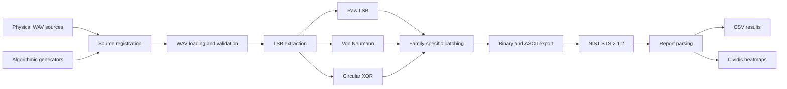
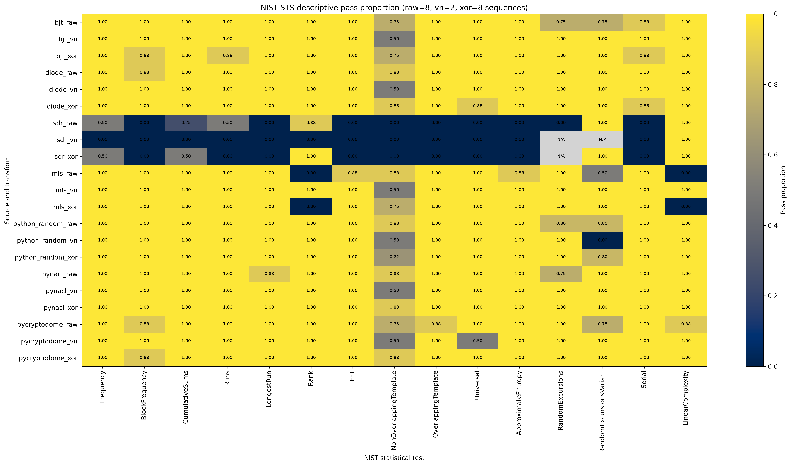
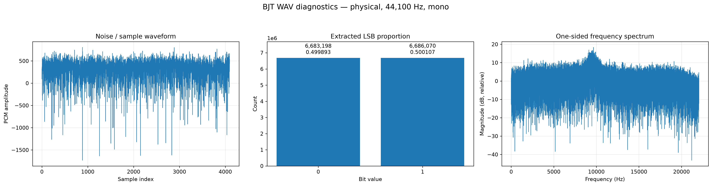
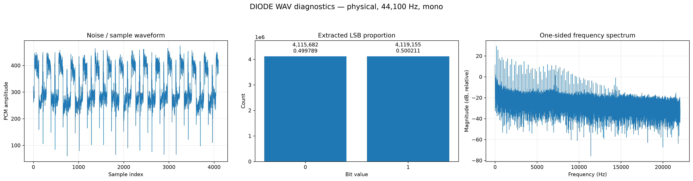
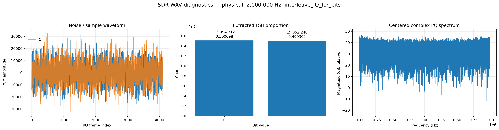

# Comparative Statistical Analysis of Random Bit Sources

[](https://atoms-conferences.org/)
[](https://ieeexplore.ieee.org/document/11583673)
[](https://www.python.org/)
[](notebooks/Comparative_Statistical_Analysis_Corrected_Combined_WAV_Diagnostics.ipynb)

Software and data-analysis pipeline accompanying the research presented at the **2026 IEEE Conference on Advanced Topics on Measurement and Simulation (ATOMS 2026)**, held in Cluj-Napoca, Romania.

**Associated paper:** [IEEE Xplore document 11583673](https://ieeexplore.ieee.org/document/11583673)

> This repository supports reproducibility of the signal preparation, bit extraction, post-processing, NIST Statistical Test Suite execution, report parsing, and visualization used in the study.

---

## Overview

The project compares **seven random-bit sources** using a common software-processing and statistical-evaluation workflow.

### Physical and acquired sources

- BJT noise
- diode noise
- SDR complex I/Q samples

### Algorithmic reference sources

- degree-32 maximal-length sequence
- Python `random`
- PyNaCl random bytes
- PyCryptodome ChaCha20 keystream

### Processing variants

Each source is evaluated in three forms:

1. **Raw LSB** — least-significant-bit extraction from integer samples
2. **Von Neumann** — pair-based debiasing using `01 → 0` and `10 → 1`
3. **Circular XOR** — length-preserving lag-1 XOR whitening

This produces **21 source/transformation variants**.

---

## Software processing pipeline




### Batching policy

The notebook uses the same common raw-data window for all sources.

Sequence counts are selected separately by transformation family:

- raw variants share one common count;
- XOR variants share one common count;
- all Von Neumann variants share one common count;
- Von Neumann may use fewer sequences because debiasing discards equal pairs;
- incomplete trailing sequences are discarded;
- no input is padded, repeated, or looped.

Raw and XOR target **10 sequences of 1,000,000 bits**. Von Neumann targets a larger count when the available data permits useful second-level uniformity analysis.

---

## Main result figure



The heatmap summarizes the most conservative pass proportion for each NIST test family.

- values near `1.00` indicate a high proportion of passing eligible sequences;
- values near `0.00` indicate poor performance;
- `N/A` indicates that the test did not produce an applicable numeric result;
- `N/A` must not be interpreted as an automatic failure.

`RandomExcursions` and `RandomExcursionsVariant` may be unavailable when too few sequences satisfy their random-walk cycle requirement.

---

## Source diagnostics

Each source receives a combined waveform, LSB-balance, and spectral diagnostic.

| Physical source | Diagnostic |
|---|---|
| BJT |  |
| Diode |  |
| SDR I/Q |  |

The SDR spectrum is computed from the complex baseband signal \(I+jQ\), while mono sources use a one-sided real-valued spectrum.

---

## High-level facts

- **7 sources**
- **3 processing strategies**
- **21 analyzed variants**
- **1,000,000 bits per NIST sequence**
- **15 NIST test families**
- binary and ASCII exports for every variant
- SHA-256 provenance for generated inputs and archived reports
- project-relative paths in outputs and metadata
- automated NIST execution, validation, parsing, and visualization
- full row-level and conservative aggregated result tables

Passing the NIST suite does **not** prove unpredictability, entropy quality, or cryptographic security. The results describe consistency with the statistical properties examined by the selected tests.

---

## Repository structure

```text
.
├── config/                     # Optional analysis configuration
├── data/
│   ├── input/                  # Physical and algorithmic WAV inputs
│   ├── nist_input/             # Generated NIST .bin and .txt files
│   └── processed/              # Optional intermediate data
├── figures/
│   ├── nist_pass_proportion_heatmap_cividis.png
│   └── source_diagnostics/
├── notebooks/
│   └── Comparative_Statistical_Analysis_Corrected_Combined_WAV_Diagnostics.ipynb
├── results/                    # CSV summaries and parsed NIST results
├── src/                        # Reusable Python modules
├── requirements.txt
└── sts-2.1.2/                  # Local NIST STS source/build
```

Large raw recordings, generated NIST inputs, logs, compiled objects, and mutable NIST working directories should normally be excluded from Git or stored with Git LFS.

---

## Installation

```bash
git clone <repository-url>
cd <repository-name>

python3 -m venv .venv
source .venv/bin/activate

python -m pip install --upgrade pip
python -m pip install -r requirements.txt
```

The notebook expects NIST STS 2.1.2 at:

```text
sts-2.1.2/
```

Build the executable from the NIST directory:

```bash
cd sts-2.1.2
make
cd ..
```

---

## Expected input layout

```text
data/input/
├── bjt/bjt.wav
├── diode/diode.wav
├── sdr/sdr.wav
└── algorithmic/
    ├── mls/mls.wav
    ├── python_random/python_random.wav
    ├── pynacl/pynacl.wav
    └── pycryptodome/
        ├── pycryptodome_chacha20.wav
        └── pycryptodome_chacha20_metadata.json
```

Mono WAV files are processed directly. The SDR WAV must contain at least two channels interpreted as I and Q.

---

## Running the analysis

Open:

```text
notebooks/Comparative_Statistical_Analysis_Corrected_Combined_WAV_Diagnostics.ipynb
```

Then run:

```text
Kernel → Restart Kernel and Run All Cells
```

The notebook will:

1. validate project paths and dependencies;
2. generate or reuse algorithmic sources;
3. load and validate all WAV files;
4. extract raw LSB streams;
5. create source diagnostics;
6. apply Von Neumann and circular XOR processing;
7. determine common sequence counts;
8. export and verify NIST inputs;
9. execute NIST STS;
10. archive and parse reports;
11. generate result matrices and heatmaps.

---

## Key outputs

```text
figures/nist_pass_proportion_heatmap_cividis.png
figures/source_diagnostics/

results/batching_summary_by_transform.csv
results/common_raw_input_summary.csv
results/nist_input_manifest.csv
results/nist_input_verification.csv
results/nist_results_long.csv
results/nist_results_aggregated.csv
results/nist_pass_proportion_matrix.csv
results/result_interpretation_overview.csv
results/transformation_summary.csv
results/vn_sequence_requirement_summary.csv
```

`nist_results_long.csv` preserves individual NIST report rows.  
`nist_results_aggregated.csv` provides a conservative family-level summary for visualization.

---

## Reproducibility

The pipeline records:

- source-relative paths;
- source and export SHA-256 hashes;
- sequence size and count;
- transformation retention;
- NIST input hashes;
- archived report hashes;
- run metadata and result locations.

Absolute usernames and local home-directory paths are intentionally omitted from displayed and saved metadata.

---

## Research limitations

This repository evaluates statistical behavior, not physical entropy security.

The workflow does not directly establish:

- min-entropy;
- resistance to prediction;
- adversarial resistance;
- independence between acquisition sessions;
- robustness across temperature, supply, RF, or hardware conditions;
- cryptographic suitability.

Physical-source conclusions should be supported by repeated acquisitions under controlled and varied operating conditions.

---

## Paper and conference

This repository accompanies the paper available as:

- **IEEE Xplore:** [Document 11583673](https://ieeexplore.ieee.org/document/11583673)
- **Conference:** [2026 IEEE Conference on Advanced Topics on Measurement and Simulation](https://atoms-conferences.org/)
- **Dates:** 13–15 May 2026
- **Location:** Cluj-Napoca, Romania

Use the official **Cite This → IEEE** entry on IEEE Xplore when citing the paper.

```text
M. P. Tamaș and T. Petrița, "A Comparative Entropy Analysis of BJT Avalanche Noise, SDR Noise and Algorithmic PRNGs," 2026 Advanced Topics on Measurement and Simulation (ATOMS), Cluj-Napoca, Romania, 2026, pp. 1-4, doi: 10.1109/ATOMS69836.2026.11583673. keywords: {Noise;Testing;Entropy;Generators;Cryptography;Printing;Standards;Hardware;Sequential analysis;Software;True Random Number Generator (TRNG);Avalanche Noise;Cryptography;NIST SP 800-22;BJT;Entropy Source},
```

---

## NIST reference

L. E. Bassham III *et al.*, *A Statistical Test Suite for Random and
Pseudorandom Number Generators for Cryptographic Applications*, NIST Special
Publication 800-22 Revision 1a, 2010.

---

## License

Source code and notebooks are licensed under the
[Apache License 2.0](LICENSE).

Original documentation, figures, and result tables are licensed under
[Creative Commons Attribution 4.0](LICENSE-DATA).

Third-party components, including NIST STS, remain subject to their original
licenses and terms.